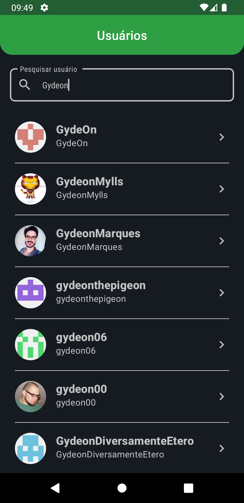

# GitHub App
Ao criar esse aplicativo, utilizei as seguintes tecnologias e padrões: MVVM, ViewBinding, Navigation, Paging, Retrofit, Flow, Modularização, Design Patterns, SOLID, Injeção de Dependência (DI) e Clean Arquicteture.

## Screenshots
|
|
|
|
|

## Tecnologias Utilizadas
A arquitetura MVVM (Model-View-ViewModel) serviu como a base sólida para o desenvolvimento do aplicativo. Com a separação clara entre modelos, visualizações e modelos de visualização, pudemos obter uma estrutura organizada e de fácil manutenção. O MVVM também facilitou a implementação do padrão de fluxo de dados unidirecional, proporcionando um código mais previsível e escalável.

A utilização do ViewBinding simplificou o processo de vinculação das visualizações ao código, eliminando a necessidade de chamadas explícitas ao findViewById(). Com essa tecnologia, conseguimos uma referência direta às visualizações de forma segura e eficiente, melhorando a legibilidade e a produtividade no desenvolvimento da interface do usuário.

O componente de Navigation nos permitiu implementar a navegação entre as diferentes telas do aplicativo de maneira intuitiva e estruturada. Com a definição clara dos destinos de navegação e a passagem de argumentos, proporcionamos uma experiência de usuário fluida e consistente.

A tecnologia de Paging foi aplicada para lidar com listas grandes e melhorar o desempenho geral do aplicativo. Com o carregamento sob demanda dos dados e a exibição de apenas uma quantidade limitada de itens por vez, conseguimos otimizar o consumo de recursos e garantir uma experiência de rolagem suave.

Para as chamadas de API e a integração com serviços web, foi utilizado o Retrofit. Essa biblioteca simplificou a comunicação com o servidor, tratando automaticamente a serialização e desserialização de dados, além de fornecer recursos avançados, como autenticação e gerenciamento de interceptadores.

A programação reativa foi aplicada por meio do uso do Flow, permitindo uma manipulação mais eficiente e concisa de fluxos contínuos de dados assíncronos. Com essa abordagem, conseguimos lidar com eventos assíncronos de forma reativa e responsiva.

A modularização do código foi realizada para garantir a escalabilidade e a reutilização. Dividimos o aplicativo em módulos independentes, permitindo que cada parte do sistema fosse desenvolvida e testada separadamente. Isso resultou em um código mais organizado, facilitando a colaboração entre os desenvolvedores e a manutenção do aplicativo.

A aplicação de Design Patterns e princípios SOLID foi fundamental para criar uma estrutura coesa e de fácil manutenção.

A Injeção de Dependência (DI) foi adotada para desacoplar as dependências entre os componentes do aplicativo. Com um framework de DI, conseguimos injetar as dependências de forma eficiente, melhorando a testabilidade, a flexibilidade e a escalabilidade do código.

Alem de todas as tecnologias utilizadas, foi adicionado a compatibilidade para temas claros e escuros de acordo com as configurações do dispositivo.

